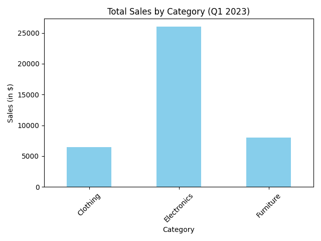

# Анализ продаж за 1 квартал 2023 года

Этот проект включает анализ данных о продажах по категориям товаров за 1 квартал 2023 года. Используется Python и библиотеки `pandas` и `matplotlib`.

### Описание файлов:
- `sales_data.csv` — данные о продажах.
- `sales_analysis.py` — скрипт для анализа данных и генерации графика.
- `sales_by_category.png` — диаграмма с суммой продаж по категориям.

### График:

График показывает, как распределяются продажи по категориям за первый квартал 2023 года.
